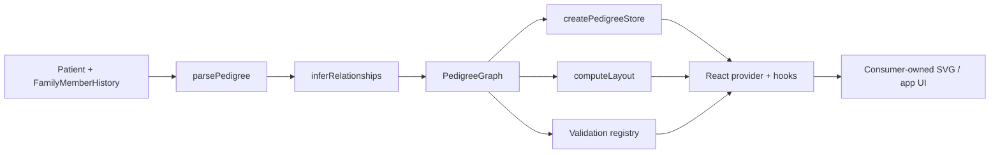

# pedigree-fhir

[](https://www.npmjs.com/package/@pedigree-fhir/core)
[](https://www.npmjs.com/package/@pedigree-fhir/react)

Headless TypeScript toolkit for parsing pedigree-relevant FHIR resources, inferring family structure, computing PSC-aware pedigree layout, and rendering the result with consumer-owned UI.

The repository is organized as a PNPM monorepo:

| Package/App | Purpose |
| --- | --- |
| `@pedigree-fhir/core` | Framework-agnostic parsing, graph/model, PSC semantics, layout, state, editing, history, and validation |
| `@pedigree-fhir/react` | React provider, hooks, and render-prop primitives on top of the headless core store |
| `@pedigree/docs` | Docusaurus docs site for guides and API reference |
| `apps/demo` | Minimal Vite consumer proving the packages can drive different SVG presentations |
| `apps/storybook` | Story-driven proof surface for primitives, interactivity, editing, validation, PSC, and themes |
| `e2e` | Playwright flow and visual regression coverage |

## Package releases

Published package visibility in this repository points to **npmjs**:

| Package | npm |
| --- | --- |
| `@pedigree-fhir/core` | https://www.npmjs.com/package/@pedigree-fhir/core |
| `@pedigree-fhir/react` | https://www.npmjs.com/package/@pedigree-fhir/react |

GitHub Packages is intentionally **not** used as a second npm registry under the
current repository owner namespace. The source of truth for JavaScript package
distribution is npmjs, and the README links above are the repository-facing
release visibility surface.

## What this project does

The core package takes a `Patient` plus related `FamilyMemberHistory` resources, turns them into a pedigree graph, fills in predictable structural relationships, computes display geometry, and exposes validation diagnostics. The React package does **not** add styling or a prebuilt chart component; it gives you the store, hooks, and render-prop primitives needed to render the pedigree with your own SVG or UI system.

That design goal shows up throughout the repo:

- **FHIR-aware**: starts from `Patient` and `FamilyMemberHistory`, including genetics extension data.
- **PSC-aware**: models twins, consanguinity, pregnancy outcomes, adoption, proband markers, vital state, and related pedigree semantics.
- **Headless**: exports graph and layout data rather than imposing a theme or component library.
- **Editable**: state, graph edits, couple edits, and history/undo-redo live in the core store.
- **Verified**: CI enforces lint, typecheck, builds, Playwright, and 100% test coverage for the packages.

## High-level flow



For a deeper explanation, see [Architecture](docs/architecture.md).

## Repository structure

```text
.
├── packages/
│   ├── core/        # headless FHIR + pedigree engine
│   └── react/       # React adapter over the core store/layout surface
├── apps/
│   ├── docs/        # Docusaurus docsite
│   ├── demo/        # minimal consumer app
│   └── storybook/   # proof surface and visual examples
├── e2e/             # Playwright flow and visual tests
└── docs/            # markdown architecture and contributor docs
```

## Local development

### Prerequisites

- Node.js 20+
- PNPM 9.12.0

### Install

```bash
pnpm install
```

### Common commands

| Command | Purpose |
| --- | --- |
| `pnpm run lint` | Biome checks the repo |
| `pnpm run typecheck` | Type-check all workspace projects |
| `pnpm run test` | Run package Vitest suites |
| `pnpm run test:coverage` | Run package tests with coverage |
| `pnpm run mutation` | Run the opt-in Stryker mutation workflow for both packages |
| `pnpm run build` | Build `@pedigree-fhir/core` and `@pedigree-fhir/react` |
| `pnpm run docs:dev` | Start the local docs stack: Docusaurus + Storybook |
| `pnpm run docs:build` | Build the Docusaurus docsite |
| `pnpm run pages:build` | Build a combined GitHub Pages artifact with the docsite at `/` and Storybook at `/storybook` |
| `pnpm run release:check` | Run the full pre-publish verification bar for the npm packages |
| `pnpm run release:pack` | Create local npm tarballs for `@pedigree-fhir/core` and `@pedigree-fhir/react` in `.release-tmp/` |
| `pnpm run e2e` | Run Playwright flow + visual tests |
| `pnpm -F @pedigree/demo dev` | Start the demo app |
| `pnpm -F @pedigree/storybook dev` | Start Storybook on port 6006 |

## Verification standard

The repo treats documentation and verification as first-class concerns. The current CI flow runs:

1. lint
2. typecheck
3. package coverage with a **100% threshold**
4. package builds
5. Storybook build
6. docsite build
7. Playwright docs, flow, and visual tests

Mutation testing is available as a **local, opt-in investigation workflow** via Stryker. It is intentionally separate from the main CI gate until its runtime and signal justify promotion.

See [.github/workflows/ci.yml](.github/workflows/ci.yml) and [Development](docs/development.md) for details.

## GitHub Pages deployment shape

The production doc experience is intended to publish as a **single GitHub Pages artifact**:

- Docusaurus at the site root
- Storybook under `/storybook`

Use `pnpm run pages:build` to assemble that artifact locally into `dist/pages`.

## Manual npm release

The first npm release path in this repo is intentionally manual.

Release targets:

- `@pedigree-fhir/core`
- `@pedigree-fhir/react`

Recommended order:

1. `npm login`
2. `pnpm run release:check`
3. `pnpm run release:pack`
4. `pnpm run release:publish:core`
5. `pnpm run release:publish:react`
6. verify both packages with `npm view`

The React package depends on the matching released core version, so publish
**core first** and **react second**.

`release:check` intentionally disables Playwright server reuse, so any stale
local docs/demo/Storybook servers do not mask a broken release candidate.

## Automated npm publish

Once the `@pedigree-fhir` scope exists and npm trusted publishing is configured
for this repository, releases can be triggered from GitHub Actions with the
**Publish npm packages** workflow.

Recommended operator flow:

1. commit the new package version(s) to `main`
2. open **Actions → Publish npm packages**
3. run the workflow from the `main` branch

What the workflow does:

1. runs `pnpm run release:check`
2. checks whether each package version already exists on npm
3. publishes `@pedigree-fhir/core` first if needed
4. confirms the core version is available on npm
5. publishes `@pedigree-fhir/react` if needed

Important notes:

- the workflow is **manual dispatch only** for the first automation pass
- it is designed for **npm trusted publishing** via GitHub Actions OIDC rather
  than a long-lived npm token
- if npm requires the package entry to exist before trusted publishing can be
  configured, complete the first successful manual publish first
- rerunning the workflow is safe for already-published versions because it skips
  versions that already exist on npm

## Package entry points

- [`packages/core/README.md`](packages/core/README.md): parsing, graph, layout, state, validation
- [`packages/react/README.md`](packages/react/README.md): provider, hooks, render-prop primitives

## Minimal example

This is the smallest accurate end-to-end flow represented in the repo today:

```ts
import { createPedigreeStore, inferRelationships, parsePedigree } from '@pedigree-fhir/core';

const graph = inferRelationships(parsePedigree(patient, familyHistory));
const store = createPedigreeStore({
  graph,
  layoutOptions: {},
});
```

In React, you then provide that store and render your own UI:

```tsx
import { PedigreeProvider, Pedigree } from '@pedigree-fhir/react';

<PedigreeProvider store={store}>
  <Pedigree>
    {({ graph, layout }) => {
      // render your own SVG using layout.nodes, layout.partnerEdges, layout.parentDrops
      return null;
    }}
  </Pedigree>
</PedigreeProvider>;
```

## Documentation map

- [Introduction](docs/intro.md)
- [Getting started](docs/getting-started.md)
- [Package map](docs/package-map.md)
- [Playground guide](docs/playground.mdx)
- [Architecture](docs/architecture.md)
- [Development](docs/development.md)
- [`@pedigree-fhir/core` README](packages/core/README.md)
- [`@pedigree-fhir/react` README](packages/react/README.md)

## Documentation surfaces

- **Docusaurus** owns the narrative docs and autogenerated API reference.
- **Storybook** owns the interactive playground and proof stories.

That split keeps the docs simple while preserving a real demo surface.
