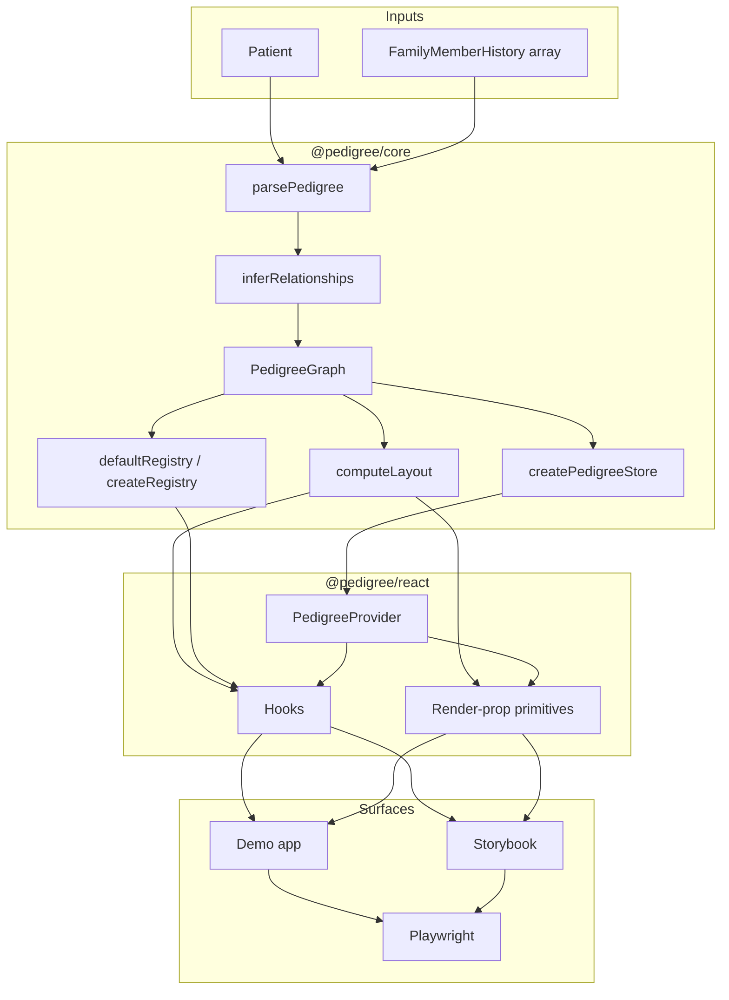
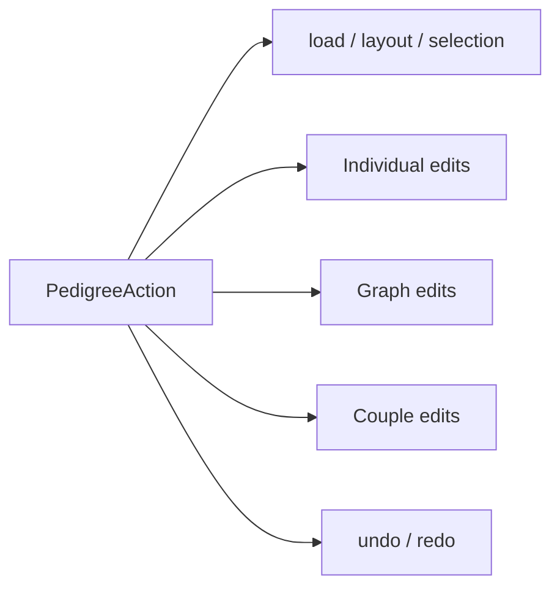
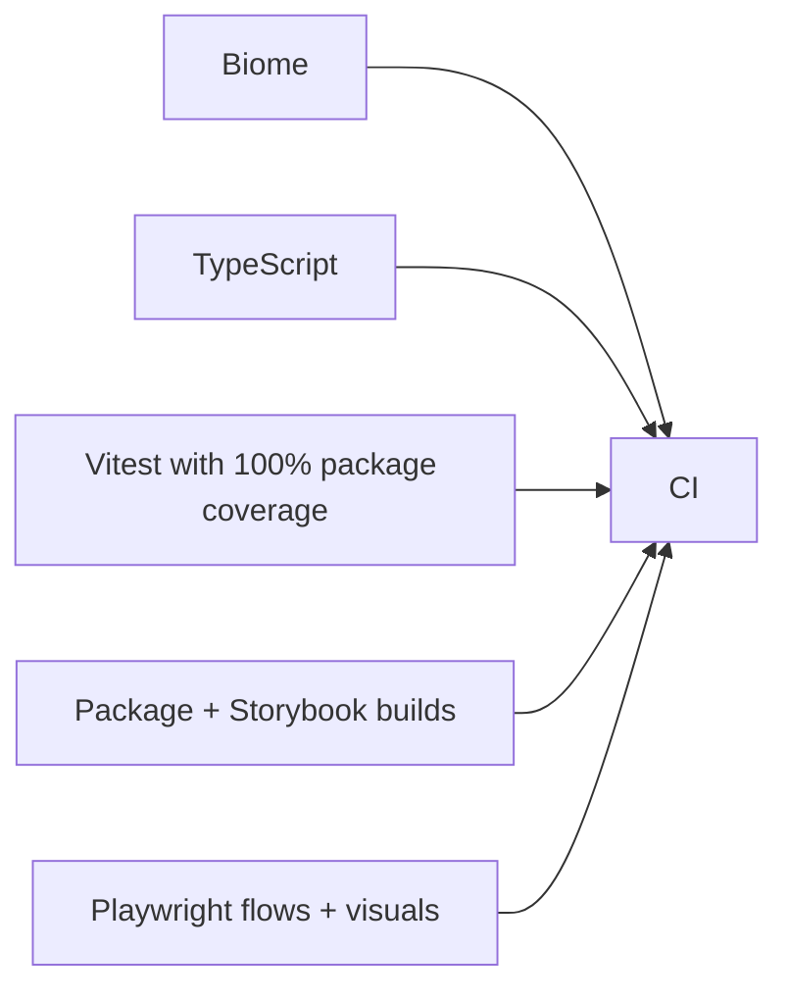

# Architecture

This document explains the current system architecture of `pedigree-fhir` as implemented in the repository today.

## System layers

At a high level, the project is split into five layers:

1. FHIR ingestion and pedigree-domain modeling
2. Relationship inference and PSC semantics
3. Layout, state, editing, and validation
4. React adapter and rendering primitives
5. Demo, Storybook, and browser verification

## Layer map

## Data flow

### 1. Parsing

`parsePedigree(patient, familyHistory)` performs the deterministic conversion from FHIR resources into a `PedigreeGraph`.

Important behavior:

- builds the proband from `Patient`
- turns each `FamilyMemberHistory` into an individual when possible
- reads genetics-parent and genetics-sibling extensions
- creates explicit couples and child-of edges when the input is clear
- groups twin relationships transitively
- stays lenient on malformed partial input so rendering can continue

This stage should be thought of as **source interpretation**, not topology repair.

### 2. Relationship inference

`inferRelationships(graph)` fills in predictable structural pedigree relationships from the available evidence.

Examples:

- inferring parents of the proband from direct mother/father codes
- attaching siblings to the same parent couple
- inferring maternal and paternal grandparent couples
- fabricating missing relatives where the topology is strongly implied

This stage is the bridge between partially structured input and a chartable pedigree graph.

### 3. Layout

`computeLayout(graph, options)` converts the pedigree graph into headless geometry:

- node positions
- partner-edge paths
- parent-drop paths
- twin-junction metadata
- overall bounds

The output is deliberately SVG-friendly: consumer code can drop the path strings straight into `<path d="...">`.

PSC-specific layout behavior includes:

- double partner edges for consanguinity
- twin junctions, including monozygotic extra connectors
- pregnancy and adoption semantics exposed to downstream rendering

## State model

The core store is a small external-store abstraction:

- `getState()`
- `dispatch(action)`
- `subscribe(listener)`

The state shape includes:

- `graph`
- `layoutOptions`
- `selectedId`
- `history`

### Why the store lives in core

The store is intentionally **framework-agnostic** so that:

- non-React consumers can drive it directly
- React becomes a thin subscription layer instead of the source of truth
- editing, selection, compact-mode behavior, and undo/redo stay domain-centered

### Action families

The action surface is split into three edit families plus non-edit actions:

- **Individual edits**: sex, vital status, conditions, carrier state, adoption, proband
- **Graph edits**: add/remove relatives
- **Couple edits**: consanguinity, twin state
- **History**: undo and redo only track edit actions

## Validation model

Validation is registry-driven rather than hardcoded in consumers.

The default registry currently includes:

- completeness
- sex/relationship consistency
- cycles
- unknown codes

This is important architecturally because validation runs alongside the graph and layout model, not as a UI-only concern.

## React adapter

`@pedigree/react` wraps the core store with:

- a provider (`PedigreeProvider`)
- hooks for slices of state and action surfaces
- render-prop primitives (`Pedigree`, `Node`, `Edge`, `Sibship`)

The key architectural choice is that the React layer is **not** a visual chart component. It passes graph/layout state to consumer code and lets the consumer render SVG however they want.

## Proof surfaces

The repo uses two application-level surfaces to prove the design:

### Demo app

The demo app shows that the same headless library can power multiple consumer-defined visual treatments without changing the library output.

### Storybook

Storybook is the primary executable proof surface for:

- primitives
- compositions
- interactivity
- editing
- validation
- PSC layout polish
- theme wrappers

## Verification architecture

The repo’s verification stack is intentionally broad:

That matters because the architecture is not just code organization; it is also how confidence is established across parsing, state, layout, React integration, and rendered browser behavior.

## Current architectural non-goal

This document does **not** describe a standalone docs site or a polished external documentation product. In the current repository, Storybook remains a proof surface and markdown remains the conventional documentation layer.
